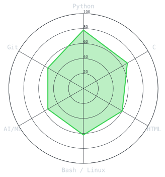
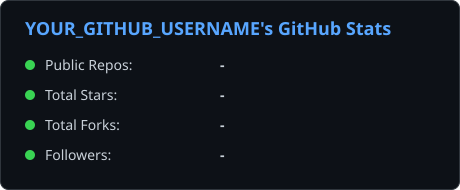
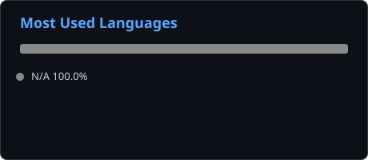

<div align="center">

<!-- PORTRAIT - generated by scripts/dotify.py from assets/portrait_source.png -->
<picture>
  <source media="(prefers-color-scheme: dark)"  srcset="assets/portrait-dark.svg">
  <source media="(prefers-color-scheme: light)" srcset="assets/portrait-light.svg">
  
</picture>

<br>

<!-- NAME / TAGLINE - animated typing -->
<a href="https://github.com/YOUR_GITHUB_USERNAME">
  
</a>

<br>

<!-- SOCIALS -->
<a href="https://linkedin.com/in/YOUR_LINKEDIN_HANDLE"></a>
<a href="mailto:YOUR_EMAIL@gmail.com"></a>
<a href="https://x.com/YOUR_X_HANDLE"></a>
<a href="https://instagram.com/YOUR_INSTAGRAM_HANDLE"></a>


</div>

---

## `~/` About ME

```console
$ cat about.txt
```

<p style="text-align: center;">
    """First, solve the problem. Then, write the code."""
</p>

I'm Zaki Malik, a second-year BTech CSE student at UPES, specializing in AI/ML. I enjoy building small, practical projects that solve a real problem end-to-end, and I'm steadily leveling up across systems programming, scripting, and the ML side of things.

-🤖 Specializing in AI/ML: exploring models, data, and how to actually ship them

-🛠️ Built projects like a **Subscription Reminder** app to solve a real day-to-day problem

-💻 Comfortable across C, Python, HTML, and Bash/Linux

-📌 "Code. Learn. Build."

<br>

<div align="center">

## `~/` toolbox


</div>

---

<div align="center">

## `~/` skill radar

<!-- Self-rated radar - edit assets/skills.json, the workflow redraws it -->
<picture>
  <source media="(prefers-color-scheme: dark)"  srcset="assets/radar-dark.svg">
  <source media="(prefers-color-scheme: light)" srcset="assets/radar-light.svg">
  
</picture>

</div>

---

<div align="center">

## `~/` the numbers

<!-- Self-hosted by scripts/cards.py -- pulls live data from the GitHub API
     and renders these as static SVGs, so the section can't be taken down
     by someone else's Vercel deployment going to sleep or hitting a quota. -->
<picture>
  <source media="(prefers-color-scheme: dark)"  srcset="assets/card-github-stats-dark.svg">
  <source media="(prefers-color-scheme: light)" srcset="assets/card-github-stats-light.svg">
  
</picture>

<br><br>

<picture>
  <source media="(prefers-color-scheme: dark)"  srcset="assets/card-github-langs-dark.svg">
  <source media="(prefers-color-scheme: light)" srcset="assets/card-github-langs-light.svg">
  
</picture>

</div>

---

### ✍️ Random Dev Quote

<div align="center">


</div>

---

<div align="center">

<sub>`01111010 01100001 01101011 01101001 00100000 01101101 01100001 01101100 01101001 01101011`</sub>

</div>
